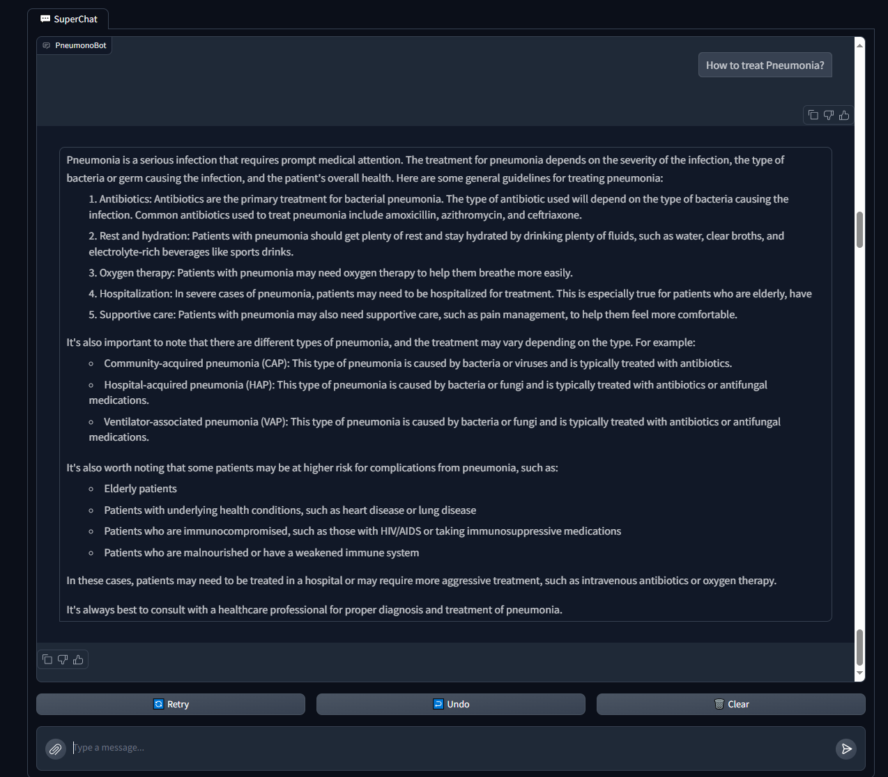
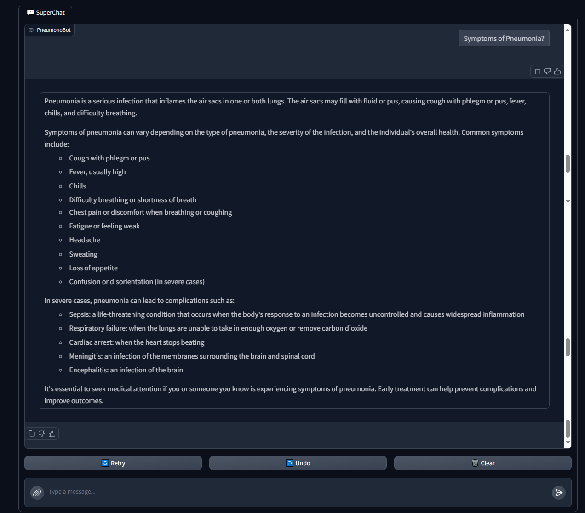

# PneumonoBot - Pneumonia Detection and Chatbot System

PneumonoBot is a system designed to classify chest X-ray images as either Normal or Pneumonia, using a fine-tuned Vision Transformer (ViT) model. It also includes a chatbot capable of answering questions related to pneumonia.

## Directories Overview

This repository is organized into various directories that contain the code and resources used in the project. Below is an overview of each folder:

- **Api Folder**: Contains the Flask API implementation. If we host the model, this API will be used to interact with the model for inference and other tasks.

- **Essentials**: This folder contains the books that were used for the Retrieval-Augmented Generation (RAG) process.

- **Pneumonia Classification Using CNN**: Initially, we used a Convolutional Neural Network (CNN) for pneumonia classification. However, this approach only achieved an accuracy between 77%-80%. As a result, we decided to switch to fine-tuning a pre-trained Vision Transformer (ViT) model.

- **Pneumonia Classification Using ViT**: This folder contains the code for fine-tuning the Vision Transformer (ViT) model. Initially, we fine-tuned the model without data augmentation and reached 87% accuracy. By applying data augmentation, we were able to improve the accuracy to 91%.

- **Save Embeddings Locally**: Originally, we planned to store our embeddings locally for easy access, and this method worked well. However, we later decided to implement a more scalable solution by uploading the embeddings to Qdrant.

- **Save Embeddings to Qdrant**: This folder tracks our entire process of storing embeddings in Qdrant, from dealing with errors to successfully uploading all embeddings. Initially, we faced challenges in selecting the correct embedding model. Ultimately, we resolved this by using the Sentence Transformer model, which provided better results.

- **Save Model from Hugging Face to Locally**: Demonstrates how we download the model from Hugging Face and save it locally for more efficient usage. This avoids the need to repeatedly load the model from Hugging Face during runtime.

- **Chatbot Folder**: Contains the implementation of the chatbot, which is available in two versions—one that uses locally stored embeddings and another that utilizes embeddings from Qdrant. Currently, the chatbot is configured to use the embeddings stored in Qdrant.

## Methodology Diagram for the Pneumonia Classification
Below is the methodology diagram followed during the pneumonia classification.

## Methodology Diagram for the implementatin of RAG
Below is the explanation of all the steps followed during the RAG implementation.

## Workflow diagram for the chatbot
Below is the simplest methodology diagram that we think any layman can understand.

## PneumonoBot Project Report

For more detailed information about the PneumonoBot project, including the entire workflow, you can refer to the comprehensive project report. The report covers everything from the introduction and dataset description to the methodology for pneumonia classification and the implementation of the Retrieval-Augmented Generation (RAG) model.

You can access the full report here: [PneumonoBot Report](./PneumonoBot%20Report.pdf)

## User Interface
Below are the screenshots showcasing the interface and results.

This is the main user interface of PneumonoBot, where users can upload chest X-ray images and interact with the chatbot. 

---

## Normal X-ray Image Result

The following screenshot shows the result after uploading a Normal X-ray image. The system correctly classifies the image as 'Normal'.

---

## Pneumonia X-ray Image Result

Here, the screenshot shows the result after uploading a Pneumonia X-ray image. The system accurately identifies the image as 'Pneumonia'.

---

## Chatbot Interaction - Q&A Example 1

This screenshot demonstrates an interaction with the PneumonoBot chatbot. The user asks a question related to pneumonia, and the chatbot provides a detailed answer.

---

## Chatbot Interaction - Q&A Example 2

Another example of the chatbot answering a question about pneumonia. The system is able to understand and respond to pneumonia-related queries effectively.

---

Feel free to try out PneumonoBot by uploading X-ray images and asking questions related to pneumonia through the chatbot.

